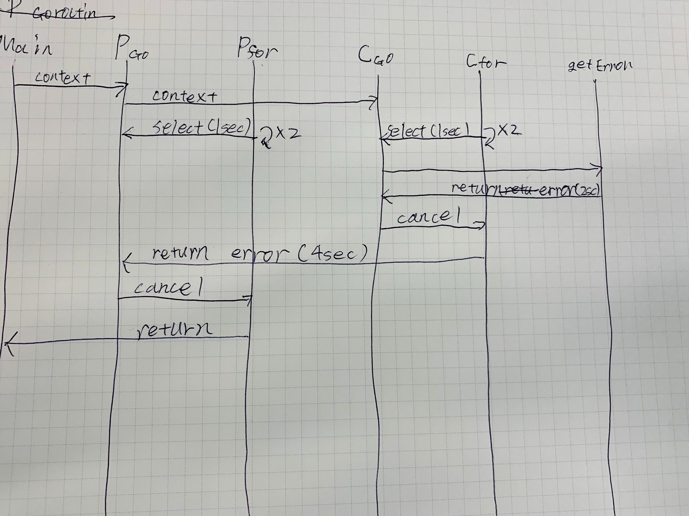

# context

ref: [初心者がGo言語のcontextを爆速で理解する ~ cancel編　~ - Qiita](https://qiita.com/yoshinori_hisakawa/items/a6608b29059a945fbbbd)
context について学ぶ

## Cancel all goroutine

main で 親の context を cancel した後、 defer で 子の context の cancel を呼び出している

## Cancel branch goroutine

理解できるように sequence を書いた

## Cancel the blocking goroutine

deadline を設定して、その時間になると cancel を呼び出す
